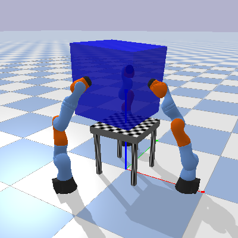

# object_impedance_control
An Implementation of Multi-Agent Object Impedance Controller from paper

*Li, M., Yin, H., Tahara, K. and Billard, A. Learning object-level impedance control for robust grasping and dexterous manipulation. 2014 IEEE International Conference on Robotics and Automation (ICRA). Hongkong, China.*

on top of modern libraries.

    

## Dependencies

[numpy](https://numpy.org/)

[gym](https://github.com/openai/gym)

[pybullet](https://github.com/bulletphysics/bullet3)
