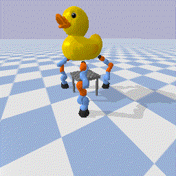

# object_impedance_control
An Implementation of Multi-Agent Object Impedance Controller from paper

*Li, M., Yin, H., Tahara, K. and Billard, A. Learning object-level impedance control for robust grasping and dexterous manipulation. 2014 IEEE International Conference on Robotics and Automation (ICRA). Hongkong, China.*

on top of modern libraries.

     
## Examples
```
python tests/test_multiagent_obj_imp_ctrl.py --agent_model=anchor --agent_num=4 --object_file=teddy2_VHACD_CHs.obj --viz --object_init_pos -0.3 0 1.0

python tests/test_multiagent_obj_imp_ctrl.py --agent_model=kuka --agent_num=3 --object_file=tray/tray_textured.obj --viz

python tests/test_multiagent_obj_imp_ctrl.py --agent_model=kuka --agent_num=4 --object_file=soccerball.obj --viz

python tests/test_multiagent_obj_imp_ctrl.py --agent_model=kuka --agent_num=4 --object_file=cube.obj --viz

python tests/test_multiagent_obj_imp_ctrl.py --agent_model=kuka --agent_num=3 --object_file=duck.obj --viz --object_scale=0.6 --object_init_rot 1.57 0 0

python tests/test_multiagent_obj_imp_ctrl.py --agent_model=kuka --agent_num=4 --object_file=sphere_smooth.obj --object_deform --object_scale=0.35 --viz


```

## Dependencies

[numpy](https://numpy.org/)

[gym](https://github.com/openai/gym)

[pybullet](https://github.com/bulletphysics/bullet3)
